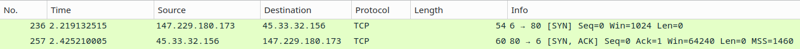
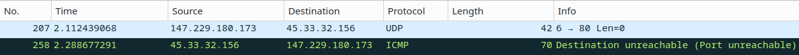

# Brno University of Technology 
## Computer Communications and Networks: Project n˚1 L4 Scanner

**Author:** Boris Hatala (xhatal02) \
**Date:** 26.03.2025

## Table of Contents
1. [Introduction](#introduction)
   - [Subject](#subject)
2. [Usage](#usage)
   - [Build](#build)
   - [Run](#run)
   - [Arguments](#arguments)
   - [Examples](#examples)
3. [Design and Implementation](#design-and-implementation)
4. [Testing](#testing)
5. [License](#license)
6. [Bibliography](#bibliography)


## Introduction

This document describes the implementation of a command-line port scanner written in C#. The application is designed to run in a Linux environment.

### Subject
This program performs a TCP SYN scan and a UDP scan of given ports on specified IP address(es). 

- **TCP SYN Scan**: Executed by sending a SYN packet to the specific port. The program then waits for either:
  - A **SYN-ACK response** indicating an **open** port, or
  - An **RST response** indicating a **closed** port.
  - If there is **no response** the port is evaluated as **filtered**.

- **UDP Scan**: Sends a UDP packet to the specified ports and analyzes the responses or lack thereof:
  - If there is **no response**, the port is considered **open**.
  - If an **ICMP** response "Destination unreachable, port unreachable" Type 3 Code 3 is received, the port is considered **closed**.


## Usage

### Build
Run make in the root folder of the project. Prerequisities are .NET9.
```
make
```

### Run

The program can be executed with the following commands:

```
./ipk-l4-scan [-i interface | --interface interface] [--pu port-ranges | --pt port-ranges | -u port-ranges | -t port-ranges] {-w timeout} [hostname | ip-address]

./ipk-l4-scan --help

./ipk-l4-scan --interface

./ipk-l4-scan -i

./ipk-l4-scan
```

### Arguments

#### `-h` or `--help`
- **Description**: Displays usage instructions.

#### `-i` or `--interface`
- **Description**: Specifies the network interface to scan through.
  - If no interface is specified (and no other arguments are provided), or if only `-i`/`--interface` is specified without a value, the program lists all active interfaces.

#### `-t` or `--pt`, `-u` or `--pu`
- **Description**: Specifies the TCP/UDP port ranges to scan. Supported formats:
  - **Single port**: `--pt 22` or `--pu 53`
  - **Port range**: `--pu 1-65535` or `--pt 1-1024`
  - **Multiple ports**: `--pt 22,23,24` or `--pu 53,80,443`
  - The `--pu` and `--pt` arguments can be used separately for TCP or UDP scanning.

#### `-w` or `--wait`
- **Description**: Sets the timeout in milliseconds for waiting for a response. If there is no response after timeout runs out the packet will be sent only once again.
  - **Optional**: This argument is not required, defaults to 5000 (five seconds).

#### `hostname` or `ip-address`
- **Description**: Specifies the target device to scan. This can be a hostname (e.g., `www.google.com`) or an IPv4/IPv6 address. When hostname is provided, scanner will scan every IP address DNS resolution provides if possible. Meaning if network interface doesn't provide IPv6 address, IPv6 addresses of the host will not be scanned.

### Examples

```
./ipk-l4-scan --interface eth0 -u 53,67 2001:67c:1220:809::93e5:917
```
```
./ipk-l4-scan -i eth0 -w 1000 -t 80,443,8080 www.vutbr.cz
```

## Design and Implementation

The L4 Scanner is implemented using standard system libraries in C#. The application is designed to run in a Linux environment and performs both TCP SYN and UDP scans on specified ports and IP addresses. Below are the details of its design and implementation:

### Argument parsing

The command-line arguments are parsed using the `System.CommandLine` library. The `CmdLineArgParser` class handles the parsing of arguments such as the network interface, port ranges, timeout, and target address. When user enters domain name e.g. www.google.com, CmdLineArgParser will check if the program can scan every IP address of this domain using network interface the use has chosen. E.g. checking if the interface has a global IPv6 address if the host has an IPv6 address.

### Socket Initialization

The `SocketInitializer` class is responsible for initializing raw sockets for both IPv4 and IPv6 addresses. It binds the sockets to the specified endpoint and prepares them for sending and receiving packets. The class also provides methods to retrieve the IP addresses of the specified network interface.

### Packet Capture Initialization

The `PacketCapture` class initializes the packet capture process using raw sockets. It sets up SocketAsyncEventArgs for asynchronous packet reception and assigns event handlers to process the received packets. The class supports capturing packets on both IPv4 and IPv6 sockets, as well as ICMP and ICMPv6 packets.

### Packet Building

The `PacketBuilder` class constructs the necessary packets for scanning. It creates IP headers (both IPv4 and IPv6) and TCP/UDP headers and calculates checksum. The headers are built using the `IpV4Header`, `IpV6Header`, `TcpHeader`, and `UdpHeader` classes. These headers implement the `IHeader` interface and are combined to form complete packets that are sent to the target ports.

### Sending Packets

The `PortScanner` class handles the sending of packets to the target ports. It uses the `PacketBuilder` class to create the packets and sends them using the initialized raw sockets. The class also manages the resending of packets if timeout for responses has run out.

### Processing Responses

The `PacketCapture` class processes the responses received from the target ports. It analyzes the packets to determine the status of the ports (open, closed, or filtered). The class uses various helper methods to parse the headers of the received packets and extract relevant information. Raw IPv6 sockets will not receive whole IP datagram, instead they receive transport layer header directly, so responses are handled accordingly. The results are then printed to the console.

## Testing
To ensure the accuracy and reliability of the L4 Scanner, the following testing methods were employed:

### 1. **Analyzing with Wireshark:**

Use Wireshark to capture and analyze the network traffic generated by the scanner.
This method was chosen to verify the validity of manually built raw packets. Wireshark option to verify checksum for IPv4, TCP and UDP protocol was checked. It's purpose was also to analyze the responses received from the target ports to ensure the output matches the expected behavior.



The expected output is `open` for tcp port 80 since we received `SYN-ACK` response.

```
$ sudo ./ipk-l4-scan -i wlp5s0 -t 80  45.33.32.156
45.33.32.156 80 tcp open
```

Similar test but for UDP:




Expected output is `closed` since we received an ICMP mesage

```
sudo ./ipk-l4-scan -i wlp5s0 -u 80  45.33.32.156
45.33.32.156 80 udp closed
```


### 2. **Comparing Output to Nmap:**

Run the L4 Scanner and Nmap on the same target and compare the results. Ensure that the port status reported by the L4 Scanner matches the output of Nmap.

Testing on `Google public DNS server`.

```
$ nmap -p443,80,53 -e enp4s0 --max-retries 1 --host-timeout 5s 8.8.8.8
Starting Nmap 7.95 ( https://nmap.org ) at 2025-03-24 12:21 CET
Nmap scan report for dns.google (8.8.8.8)
Host is up (0.0039s latency).

PORT    STATE    SERVICE
53/tcp  open     domain
80/tcp  filtered http
443/tcp open     https

Nmap done: 1 IP address (1 host up) scanned in 1.23 seconds  
```
```
$ sudo ./ipk-l4-scan -i enp4s0 -t 443,80,53 8.8.8.8
8.8.8.8 443 tcp open
8.8.8.8 53 tcp open
8.8.8.8 80 tcp filtered
```

Testing on `scanme.nmap.org`. This test also validates correct DNS resolution and that program scans multiple IP addresses of specific domain.

```
$ sudo nmap -sSU -p445,80,53 -e wlp5s0 --max-retries 1 --host-timeout 5s scanme.nmap.org
Starting Nmap 7.95 ( https://nmap.org ) at 2025-03-26 14:14 CET
Nmap scan report for scanme.nmap.org (45.33.32.156)
Host is up (0.19s latency).
Other addresses for scanme.nmap.org (not scanned): 2600:3c01::f03c:91ff:fe18:bb2f

PORT    STATE         SERVICE
53/tcp  closed        domain
80/tcp  open          http
445/tcp filtered      microsoft-ds
53/udp  closed        domain
80/udp  closed        http
445/udp open|filtered microsoft-ds

Nmap done: 1 IP address (1 host up) scanned in 4.62 seconds
```

```
$ sudo ./ipk-l4-scan -i wlp5s0 -t 445,80,53 -u 445,80,53 scanme.nmap.org
2600:3c01::f03c:91ff:fe18:bb2f 53 udp closed
2600:3c01::f03c:91ff:fe18:bb2f 80 tcp open
2600:3c01::f03c:91ff:fe18:bb2f 80 udp closed
2600:3c01::f03c:91ff:fe18:bb2f 53 tcp closed
2600:3c01::f03c:91ff:fe18:bb2f 445 udp open
2600:3c01::f03c:91ff:fe18:bb2f 445 tcp filtered
45.33.32.156 53 udp closed
45.33.32.156 80 udp closed
45.33.32.156 80 tcp open
45.33.32.156 53 tcp closed
45.33.32.156 445 udp open
45.33.32.156 445 tcp filtered
```

Testing IPv6 using nmap. IPv6 was tested using `FIT VPN` to get access to global IPv6 address.
```
$ sudo nmap -sS -p 22,80,443,9929,31337 -6 -e tun0 --max-retries 1 --host-timeout 5000ms 2600:3c01::f03c:91ff:fe18:bb2f
Starting Nmap 7.95 ( https://nmap.org ) at 2025-03-24 15:14 CET
Nmap scan report for scanme.nmap.org (2600:3c01::f03c:91ff:fe18:bb2f)
Host is up (0.16s latency).

PORT      STATE  SERVICE
22/tcp    open   ssh
80/tcp    open   http
443/tcp   closed https
9929/tcp  closed nping-echo
31337/tcp open   Elite

Nmap done: 1 IP address (1 host up) scanned in 0.41 seconds
```
```
$ sudo ./ipk-l4-scan -i tun0 -t 22,80,443,9929,31337 2600:3c01::f03c:91ff:fe18:bb2f
2600:3c01::f03c:91ff:fe18:bb2f 22 tcp open
2600:3c01::f03c:91ff:fe18:bb2f 443 tcp closed
2600:3c01::f03c:91ff:fe18:bb2f 31337 tcp open
2600:3c01::f03c:91ff:fe18:bb2f 80 tcp open
2600:3c01::f03c:91ff:fe18:bb2f 9929 tcp closed
```
Another one for UDP
```
$ sudo nmap -sU -6 -p 53,123,143,9929 -e tun0 --max-retries 1 --host-timeout 5000ms 2600:3c01::f03c:91ff:fe18:bb2f
Starting Nmap 7.95 ( https://nmap.org ) at 2025-03-24 15:30 CET
Nmap scan report for scanme.nmap.org (2600:3c01::f03c:91ff:fe18:bb2f)
Host is up (0.16s latency).

PORT     STATE  SERVICE
53/udp   closed domain
123/udp  open   ntp
143/udp  closed imap
9929/udp closed unknown

Nmap done: 1 IP address (1 host up) scanned in 0.47 seconds
```
```
$ sudo ./ipk-l4-scan -i tun0 -u 53,123,143,9929 2600:3c01::f03c:91ff:fe18:bb2f
2600:3c01::f03c:91ff:fe18:bb2f 143 udp closed
2600:3c01::f03c:91ff:fe18:bb2f 53 udp closed
2600:3c01::f03c:91ff:fe18:bb2f 9929 udp open
2600:3c01::f03c:91ff:fe18:bb2f 123 udp open
```

Mix of UDP and TCP ports, IPv6 address
```
$ sudo nmap -sSU -6 -e tun0 -p 443,80,123 --max-retries 1 --host-timeout 5000ms 2600:3c01::f03c:91ff:fe18:bb2f
Starting Nmap 7.95 ( https://nmap.org ) at 2025-03-26 13:53 CET
Nmap scan report for scanme.nmap.org (2600:3c01::f03c:91ff:fe18:bb2f)
Host is up (0.16s latency).

PORT    STATE  SERVICE
80/tcp  open   http
123/tcp closed ntp
443/tcp closed https
80/udp  closed http
123/udp open   ntp
443/udp closed https

Nmap done: 1 IP address (1 host up) scanned in 0.74 seconds
```
```
$ sudo ./ipk-l4-scan -i tun0 -t 443,80,123 -u 443,80,123 2600:3c01::f03c:91ff:fe18:bb2f
2600:3c01::f03c:91ff:fe18:bb2f 80 udp closed
2600:3c01::f03c:91ff:fe18:bb2f 80 tcp open
2600:3c01::f03c:91ff:fe18:bb2f 443 udp closed
2600:3c01::f03c:91ff:fe18:bb2f 443 tcp closed
2600:3c01::f03c:91ff:fe18:bb2f 123 tcp closed
2600:3c01::f03c:91ff:fe18:bb2f 123 udp open
```


### 3. **Using Netcat to Forcefully Open Ports on Localhost:**

To ensure the scanner's accuracy, we used Netcat to open specific ports on the localhost for testing purposes. By opening ports with Netcat, we can simulate various network conditions and verify the scanner's behavior.

```
$ nc -u -l -p 65505
```
```
$ nc -u -l -p 65504
```
```
$ nc -l -p 65503
```
Check the status of the ports
```
$ sudo ss -tulnp | grep -E ":65505|:65504|:65503|:65502"
udp   UNCONN 0      0                 0.0.0.0:65504      0.0.0.0:*    users:(("nc",pid=93659,fd=3))             
udp   UNCONN 0      0                 0.0.0.0:65505      0.0.0.0:*    users:(("nc",pid=93658,fd=3))             
tcp   LISTEN 0      1                 0.0.0.0:65503      0.0.0.0:*    users:(("nc",pid=93661,fd=3))
```
Run the scanner against the localhost and verify that it correctly identifies the open ports.
```
$ sudo ./ipk-l4-scan -i lo -t 65503,65502 -u 65505,65504 127.0.0.1
127.0.0.1 65503 tcp open
127.0.0.1 65502 tcp closed
127.0.0.1 65505 udp open
127.0.0.1 65504 udp open
```

----

Similar test but for IPv6 with mixed tcp and udp ports.
```
$ nc -6 -l -p 65000
```
```
$ nc -6 -l -p 65001
```
```
$ nc -6 -u -l -p 65002
```
```
$ nc -6 -u -l -p 65003
```
```
$ nc -6 -u -l -p 65004
```

Checking the status

```
$ sudo ss -tulnp | grep -E ":65000|:65001|:65002|:65003|:65004|:65005|:65500"
udp   UNCONN 0      0                  *:65002            *:*    users:(("nc",pid=6396,fd=3))        
udp   UNCONN 0      0                  *:65003            *:*    users:(("nc",pid=6394,fd=3))        
udp   UNCONN 0      0                  *:65004            *:*    users:(("nc",pid=6403,fd=3))        
tcp   LISTEN 0      1                  *:65001            *:*    users:(("nc",pid=6267,fd=3))        
tcp   LISTEN 0      1                  *:65000            *:*    users:(("nc",pid=6266,fd=3)) 
```

Comparing with the output of the scanner

```
$ sudo ./ipk-l4-scan -i lo -t 65000,65001,65500 -u 65002-65004 ::1
::1 65500 tcp closed
::1 65001 tcp open
::1 65000 tcp open
::1 65004 udp open
::1 65002 udp open
::1 65003 udp open
```

## License
This project is licensed under the **GNU General Public License v3.0** (GPL-3.0). See [LICENSE](LICENSE)


## Bibliography

1. Article, TCP/IP Raw Sockets https://learn.microsoft.com/en-us/windows/win32/winsock/tcp-ip-raw-sockets-2

2. Article, The Art of Port Scanning NMAP https://nmap.org/nmap_doc.html#port_unreach

3. Article, TCP SYN SCAN NMAP https://nmap.org/book/synscan.html

4. Article, Manually Create and Send Raw TCP/IP packets https://inc0x0.com/tcp-ip-packets-introduction/tcp-ip-packets-3-manually-create-and-send-raw-tcp-ip-packets/

5. RFC 791, Internet Protocol (IP) https://www.rfc-editor.org/rfc/rfc791

6. RFC 9293, Transmission Control Protocol (TCP) https://www.ietf.org/rfc/rfc9293.html

7. RFC 768, User Datagram Protocol (UDP) https://www.rfc-editor.org/rfc/rfc768

8. Article, How to Calculate IP Checksum https://web.archive.org/web/20020916085726/http://www.netfor2.com/checksum.html

9. Article, How to Calculate TCP/IP Checksum https://web.archive.org/web/20021005084753/http://www.netfor2.com/tcpsum.html

10. RFC 792, Internet Control Message Protocol (ICMP) https://www.rfc-editor.org/rfc/rfc792

11. RFC 4443, Internet Control Message Protocol (ICMPv6) for the Internet Protocol Version 6 (IPv6) https://www.rfc-editor.org/rfc/rfc4443